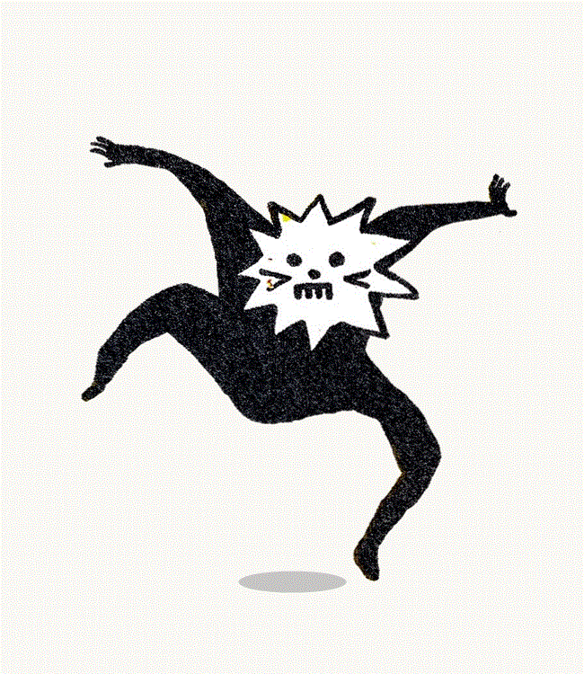
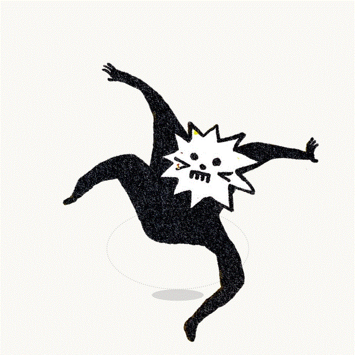
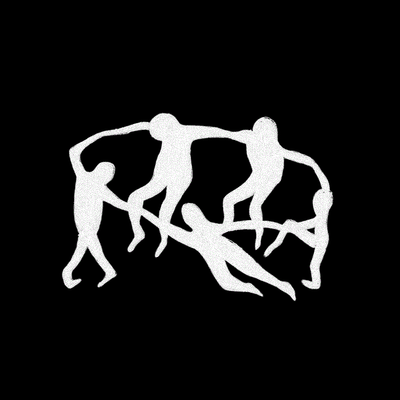
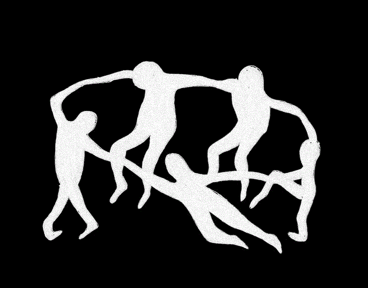

# 🕺 2D Puppet Skeleton Studio & Stop-Motion Dance Animator

[](https://gilangrizki2804-pixel.github.io/puppet-dance-studio/)
[](https://developer.mozilla.org/en-US/docs/Web/JavaScript)
[](https://developer.mozilla.org/en-US/docs/Web/API/Canvas_API)
[](https://developer.mozilla.org/en-US/docs/Web/API/Web_Audio_API)
[]()

Aplikasi web interaktif tanpa build-step (*Zero Build / Plug & Play*) untuk membuat karakter 2D apa pun menari secara luwes (*puppet skeletal deformation*) dan memutar animasi stop-motion melingkar. Siap dijalankan langsung di browser lokal maupun dihosting di **GitHub Pages**!

---

## 🌟 Demo Animasi / Preview

| 🕺 Funk Groove Dance | 🔄 Circular Dance Rhythm |
| :---: | :---: |
|  |  |

| 🏃 Stop-Motion Dancers | ⚡ Circular Matisse Animation |
| :---: | :---: |
|  |  |

---

## ✨ Fitur Unggulan (Key Features)

1. **🎨 Sistem Multi-Layer (Default 4 Lapisan Karakter):**
   - **4 Karakter Default Menari Bersama**: Hadir langsung dengan 4 layer karakter yang tersusun rapi di panggung dengan posisi, koreografi, dan ritme BPM masing-masing.
   - **Tambah & Kelola Manual**: Bebas menambah layer baru (`➕ Tambah Layer`), menduplikat (`📋 Duplikat`), menghapus (`🗑️ Hapus`), dan mengatur urutan tumpukan z-index (`🔼` / `🔽`).
   - **Upload Mandiri Per Layer**: Setiap layer dapat diunggah gambar tersendiri (klik, drag-and-drop, atau paste `Ctrl+V`), lengkap dengan fitur *Auto Background Removal* otomatis per layer.
   - **BPM & Kecepatan Independen Tiap Layer**: Setiap karakter dapat diatur temponya masing-masing (misal Layer 1: 120 BPM Funk Dance, Layer 2: 95 BPM Jalan Santai, Layer 3: 135 BPM Melambai Cepat, Layer 4: 110 BPM Lompat Enerjik).
   - **Transformasi Bebas di Panggung**: Atur posisi horizontal (Geser X), posisi vertikal (Geser Y), ukuran (Skala 40% - 180%), opasitas, dan cermin horizontal (*Flip*) untuk tiap layer secara presisi.

2. **🦴 Skeleton & Bone Rigging Fleksibel (Multi-Joint & Anchor):**
   - **Sendi Ganda (Dual-Joint Limbs)**: Setiap garis anggota tubuh memiliki 2 titik sendi fleksibel (Bahu/Dada ➔ Siku ➔ Tangan, Pinggul ➔ Lutut ➔ Telapak Kaki).
   - **⚡ Bagi Sendi (Subdivide Bone)**: Membagi garis tulang apa pun menjadi 2 segmen sendi lentur hanya dengan sekali klik.
   - **⚓ Fitur Titik Tumpu (Anchor Point)**: Mengunci titik tumpu (misal: Kaki Kiri/Kanan menapak kokoh di lantai, atau Pinggul stabil di tengah), sehingga karakter menari dengan poros dan pijakan lantai yang realistis tanpa bergeser liar.
   - **🎯 Auto-Snap to Body**: Menempatkan sendi secara proporsional otomatis di atas siluet tubuh karakter pada layer terpilih.
   - **Fitur Pin Bebas**: Tambah sendi kustom (*Add Pin*) dan hapus sendi kapan saja pada layer aktif.

3. **💃 10 Template Gerakan Manusiawi & Koreografi:**
   - 🚶 **Berjalan (Walk Cycle)**: Langkah kaki bergantian, fleksi lutut, ayunan tangan berlawanan arah, serta gerakan naik-turun panggul natural.
   - 🏃 **Berlari (Run Sprint)**: Condong tubuh ke depan, angkatan lutut tinggi, ayunan tangan 90° bertenaga, dan fase melayang di udara.
   - 🦘 **Melompat & Mendarat (Jump & Land)**: Fisika lompatan 4 fase (jongkok bersiap, melesat ke atas dengan tangan terangkat, melayang, dan mendarat lentur).
   - 🏊 **Berenang (Swimming Freestyle)**: Liukan tubuh terapung, kayuhan tangan melingkar bergantian, serta tendangan kaki renang cepat 4x tempo.
   - 👋 **Melambai & Menyapa (Wave & Greet)**: Perpindahan tumpuan santai, kemiringan kepala ramah, dan lambaian tangan kanan ke kiri-kanan.
   - 🧘 **Peregangan & Yoga (Stretch & Yoga)**: Tarikan napas dalam, kedua tangan meregang lurus ke atas, dan liukan lentur ke samping.
   - 👏 **Tepuk Tangan & Bersorak (Cheer & Clap)**: Tepukan kedua tangan berirama di depan dada disertai lompatan kecil gembira.
   - 🕺 **Funk Dance**: Goyangan pinggul funky, irama kepala, dan kelenturan sendi anggota tubuh.
   - 🌀 **Tarian Melingkar (Circle Orbit)**: Menari berputar mengitari lintasan melingkar 3D dinamis.
   - 🌊 **Ombak Tubuh (Body Wave)**: Gelombang tarian fluida elastis (*liquid wave motion*) mengalir dari kepala hingga ujung kaki.

4. **🎵 Built-in Web Audio API Synthesizer:**
   - Drum beat synthesizer 4/4 dinamis (Kick, Snare, Hi-hat, Bass synth) yang sinkron dengan ketukan ritme tarian.

5. **🎬 Ekspor Video Full HD 1080p Bersih dengan 5x Auto-Loop & Opsi Background:**
   - **Pilihan Background Hasil Download**:
     - 🏁 **Transparan (Alpha Channel)**: Menghasilkan video WebM atau foto PNG tanpa latar belakang (tembus pandang murni), siap pakai sebagai overlay animasi di Premiere, After Effects, CapCut, DaVinci Resolve, maupun OBS Studio.
     - 🖼️ **Ikuti Panggung**: Menggunakan latar belakang panggung studio saat ini (Kertas Krem, Putih, Gelap, Grid).
     - 🟩 **Green Screen (#00FF00 Chroma Key)**: Menghasilkan video berlatar hijau murni, sangat ideal untuk diekspor ke MP4 lalu di-chroma key di aplikasi edit video smartphone maupun PC.
   - **Kualitas Full HD 1080p**: Rekaman langsung dari kanvas native 1080×1080 dengan bitrate tinggi 12 Mbps (*crystal clear, zero compression artifacts*).
   - **Auto-Loop 5 Kali Penuh**: Tombol unduh otomatis merekam tepat **5 siklus putaran (5 full loops)** penuh dan berkesinambungan tanpa patahan.
   - **Bersih Tanpa Skeleton**: Video yang didownload murni hanya menampilkan karakter bergerak di atas panggung (garis skeleton, titik sendi, dan label otomatis dihilangkan saat perekaman).
   - **Format MP4 (H.264) & WebM**: Kompatibel langsung untuk diputar di HP, diunggah ke WhatsApp, Instagram Reels, TikTok, YouTube Shorts, dll.
   - Menggabungkan musik drum beat synthesizer langsung ke dalam audio track video.

6. **🔄 Stop-Motion Player (`stop_motion_player.html`):**
   - Pemutar stop-motion melingkar dengan kontrol kecepatan frame, reverse, dan trail effect.

---

## 🚀 Cara Menjalankan Secara Lokal (Local Run)

Aplikasi ini dibuat dengan prinsip **Zero Configuration & Zero Build Step**:
1. Clone atau download repository ini.
2. Klik ganda file [`index.html`](index.html) atau klik kanan > *Open with* browser favorit Anda (Chrome, Edge, Firefox, Brave, Safari).
3. Aplikasi langsung berjalan 100% tanpa perlu Node.js, npm, atau server lokal!

---

## 🌐 Cara Mengunggah & Mengaktifkan di GitHub Pages

Ikuti langkah cepat berikut untuk mengunggah ke akun GitHub Anda dan menjadikannya web app online yang bisa diakses siapa saja:

### 1. Buat Repository Baru di GitHub
1. Buka [GitHub New Repository](https://github.com/new).
2. Beri nama repository (misalnya: `puppet-dance-studio`).
3. Pilih **Public**, lalu klik **Create repository** (jangan centang *Initialize with README* karena file sudah siap di lokal).

### 2. Hubungkan & Push dari Terminal / PowerShell
Buka terminal pada folder proyek ini, lalu jalankan perintah:

```bash
# Tambahkan alamat remote repository GitHub Anda
git remote add origin https://github.com/gilangrizki2804-pixel/puppet-dance-studio.git

# Pastikan branch utama bernama main
git branch -M main

# Unggah seluruh file ke GitHub
git push -u origin main
```

### 3. Aktifkan GitHub Pages
1. Masuk ke halaman repository Anda di GitHub: [github.com/gilangrizki2804-pixel/puppet-dance-studio](https://github.com/gilangrizki2804-pixel/puppet-dance-studio)
2. Klik tab **Settings** (di sebelah kanan atas repo).
3. Pada menu navigasi sebelah kiri, klik **Pages** (di bawah *Code and automation*).
4. Di bagian **Build and deployment**:
   - **Source**: Pilih `Deploy from a branch`.
   - **Branch**: Pilih `main` dan folder `/(root)`.
5. Klik **Save**.
6. Tunggu sekitar 1–2 menit. Website Anda akan aktif di URL:
   ```
   https://gilangrizki2804-pixel.github.io/puppet-dance-studio/
   ```

---

## 📁 Struktur File (Repository Structure)

```
Visual Project/
│
├── index.html                   # Halaman utama (Puppet Skeleton Studio) untuk GitHub Pages
├── puppet_skeleton_studio.html  # File studio rigging & tarian (identik dengan index.html)
├── stop_motion_player.html      # Player stop-motion lingkaran
├── README.md                    # Dokumentasi lengkap proyek & panduan deploy
├── .gitignore                   # Konfigurasi pengabaian file sampah sistem
│
├── character_dance_funk.gif     # Render animasi GIF: Funk Groove Dance
├── character_dance_circle.gif   # Render animasi GIF: Circle Dance
├── dancing_stop_motion.gif      # Render animasi GIF: Stop-Motion
├── dancing_circle_rhythm.gif    # Render animasi GIF: Circular Stop-Motion
│
├── dancing_character.jpg        # Gambar karakter awal
├── dancing_character_cutout.png # Versi cutout transparan hasil pengolahan
└── Daniel Zendor drawing...     # Asset referensi pose
```

---

## 💻 Lisensi & Kredit

- **Teknologi**: HTML5 Canvas, Web Audio API, Moving Least Squares (MLS) / Affine Mesh Deformation.
- **Lisensi**: Open Source (MIT) — bebas dimodifikasi, dikembangkan, dan dibagikan.
